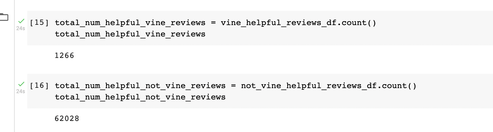
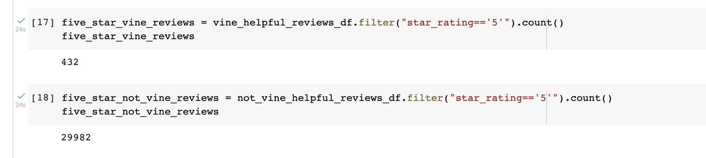
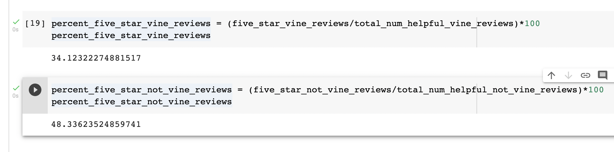

# Amazon_Vine_Analysis

## Overview

Amazon Vine is the program that pays customers to review specific Amazon products. The purpose of the current analysis is to look for any existant bias among paid vs unpaid customer reviews for toy products.  

## Results

### How Many Vine reviews and non-Vine reviews were there?

There are 1,266 Vine reviews and 62,028 non-Vine reviews.   

### How many Vine reviews were 5 stars? How many non-Vine reviews were 5 stars?

432 Vine reviews and 29,982 non-Vine reviews were ranked 5 stars. 

### What percentage of Vine reviews were 5 stars? What percentage of non-Vine reviews were 5 stars?

34.12% of Vine reviews and 48.34% of non-Vine reviews received 5 stars. 

## Summary

Based on the analysis and statistical data, we can conclude that there is minimal bias in Toy Reviews when looking at 34% of Vine reviews vs 48% of non-Vine reviews. A further analysis might be necessary to see if the data results might be skewed due to large sample size discrepency. 
